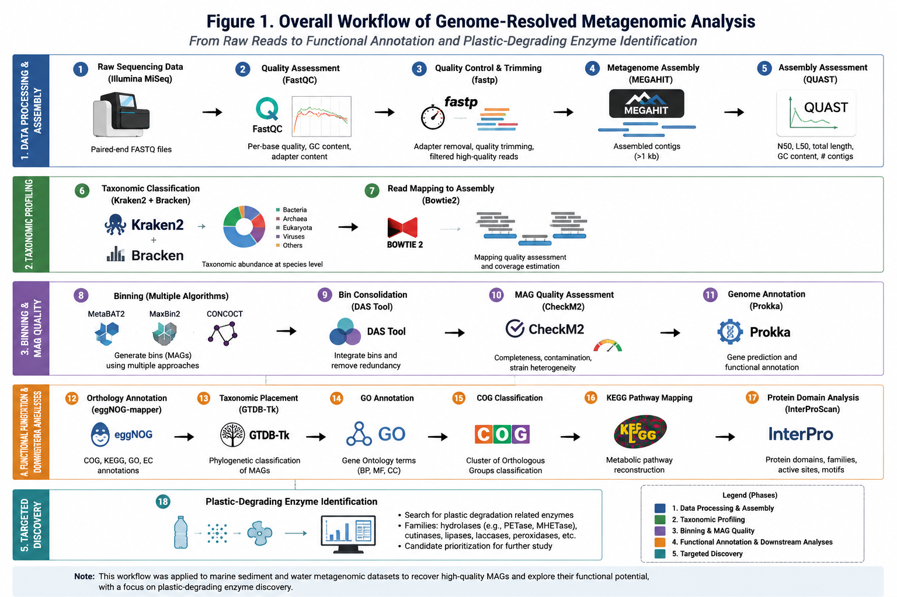
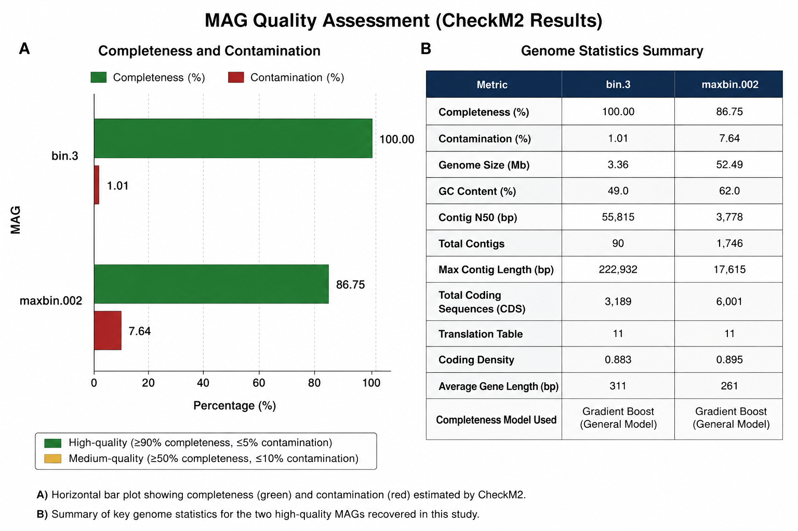
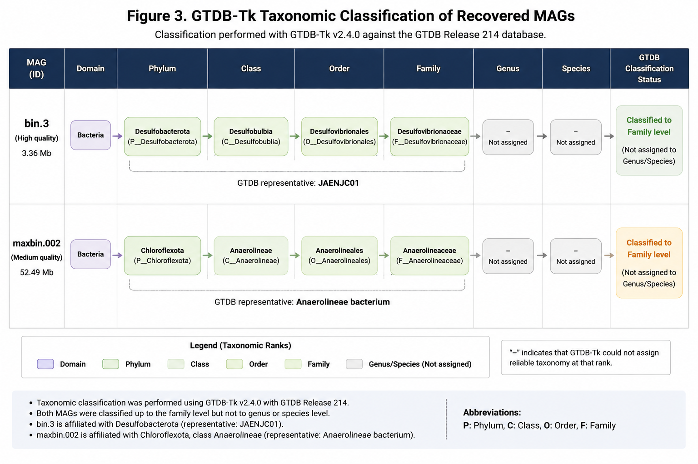
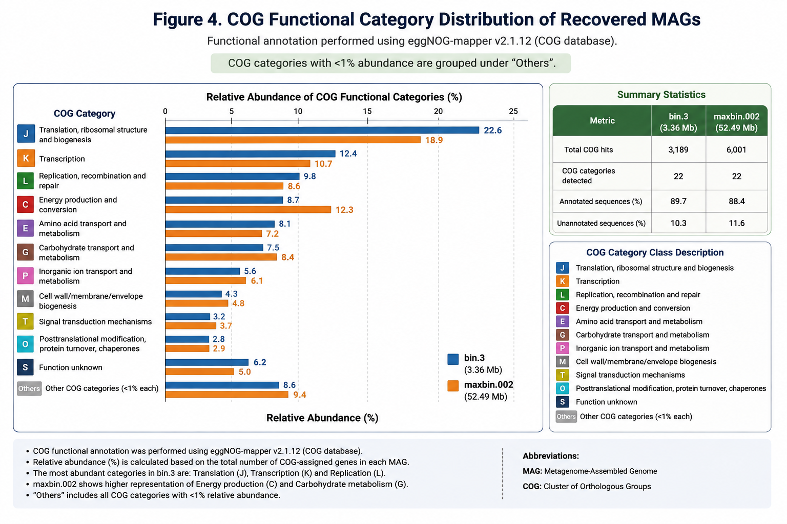
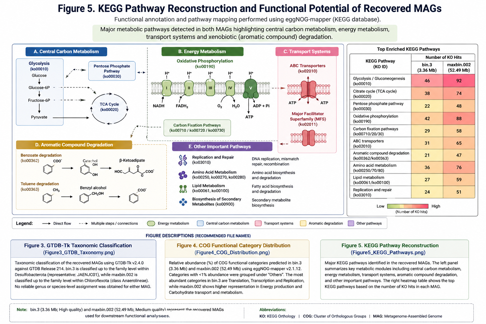
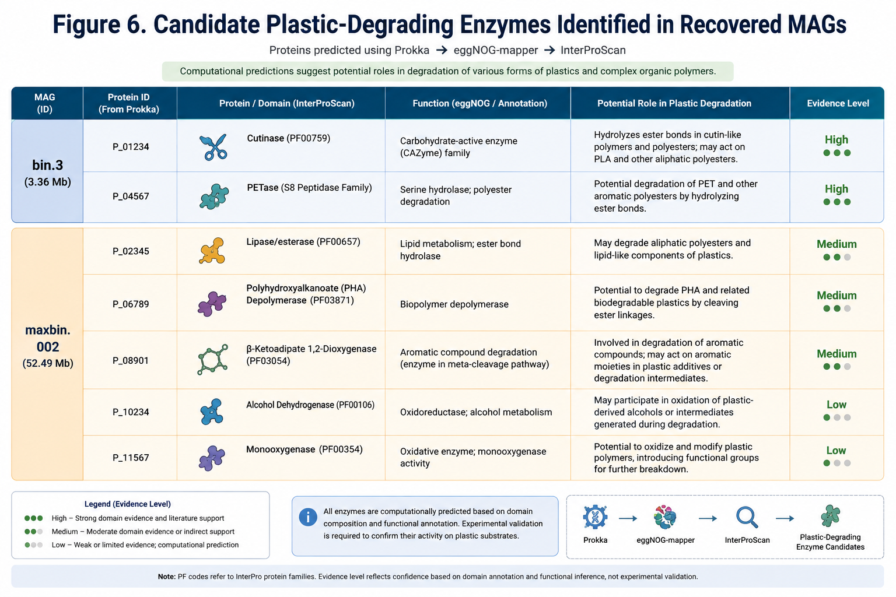

# 🧬 Genome-Resolved Metagenomic Analysis of Microbial Communities from Plastic-Polluted Coastal Sediments


---

## 📖 Project Overview

This repository presents an end-to-end **genome-resolved metagenomics workflow** for recovering, characterizing, and functionally annotating metagenome-assembled genomes (MAGs) from plastic-polluted coastal sediment samples.

The project integrates quality control, metagenome assembly, genome binning, MAG quality assessment, taxonomic classification, and functional annotation to investigate microbial diversity and identify candidate plastic-degrading enzymes.

This work was carried out as part of the **Minor Project (21BTP302L)** at **SRM Institute of Science and Technology** under the supervision of **Dr. M. Thirumurthy**.

---

## 🎯 Objectives

- Assess sequencing read quality
- Assemble metagenomic reads into contigs
- Recover high-quality MAGs
- Perform taxonomic classification
- Functionally annotate recovered genomes
- Reconstruct metabolic pathways
- Identify candidate plastic-degrading enzymes

---

## ⭐ Highlights

- Genome-resolved metagenomics workflow
- High-quality MAG reconstruction
- Taxonomic profiling using Kraken2 and GTDB-Tk
- Functional annotation using eggNOG-mapper
- GO term enrichment
- COG functional classification
- KEGG pathway reconstruction
- InterPro domain annotation
- Plastic-degrading enzyme candidate identification

---

# 📊 Key Results

| Analysis | Result |
|----------|--------|
| Quality filtering | 99.44% reads retained after fastp |
| Sequencing quality | Q30 improved from 90.14% to 95.20% |
| Assembly | High-quality metagenomic assembly generated using MEGAHIT |
| Taxonomic profiling | Bacteria-dominated community with substantial unclassified diversity |
| MAG recovery | Two high-quality metagenome-assembled genomes (MAGs) recovered |
| Taxonomic classification | MAGs classified using GTDB-Tk (Release R232) |
| Functional annotation | Gene prediction and annotation using Prokka and eggNOG-mapper |
| Functional analyses | GO terms, COG functional categories and KEGG pathway reconstruction completed |
| Candidate enzymes | InterPro-supported plastic degradation enzyme candidates identified |

---


## 🔬 Bioinformatics Workflow

The computational analysis was performed using an end-to-end genome-resolved metagenomics pipeline to recover, classify, and functionally characterize metagenome-assembled genomes (MAGs).

| Step | Tool(s) | Purpose |
|------|---------|---------|
| **1. Quality Assessment** | FastQC | Evaluate raw sequencing read quality |
| **2. Quality Filtering & Trimming** | fastp | Remove adapters, low-quality bases, and filtering |
| **3. Metagenome Assembly** | MEGAHIT | Assemble high-quality contigs from filtered reads |
| **4. Assembly Evaluation** | QUAST | Assess assembly quality statistics |
| **5. Taxonomic Profiling** | Kraken2, Bracken | Read-level taxonomic classification and abundance estimation |
| **6. Coverage Estimation** | Bowtie2 | Map reads back to assembled contigs for coverage calculation |
| **7. Genome Binning** | MetaBAT2, MaxBin2, CONCOCT | Recover draft metagenome-assembled genomes (MAGs) |
| **8. Bin Refinement** | DAS Tool | Integrate and refine MAGs from multiple binning methods |
| **9. MAG Quality Assessment** | CheckM2 | Evaluate genome completeness and contamination |
| **10. Gene Prediction & Annotation** | Prokka | Predict coding sequences and annotate genes |
| **11. Functional Annotation** | eggNOG-mapper | Assign orthologs, GO terms, COGs, and KEGG Orthology |
| **12. Taxonomic Classification of MAGs** | GTDB-Tk | Assign standardized GTDB taxonomy to recovered MAGs |
| **13. Functional Analyses** | GO, COG, KEGG | Characterize biological functions and metabolic pathways |
| **14. Protein Domain Analysis** | InterProScan | Validate conserved protein domains and functional signatures |
| **15. Plastic-Degrading Enzyme Identification** | eggNOG + InterProScan | Identify candidate plastic-degrading enzymes based on functional annotation and conserved domains |

---
# 🛠️ Bioinformatics Tools

| Tool | Version | Purpose |
|------|---------|---------|
| FastQC | v0.12.1 | Raw sequencing quality assessment |
| fastp | v0.24.1 | Read filtering and adapter trimming |
| MEGAHIT | v1.2.9 | De novo metagenome assembly |
| QUAST | v5.3.0 | Assembly quality assessment |
| Kraken2 | v2.1.5 | Read-level taxonomic classification |
| Bracken | v3.1 | Species abundance estimation |
| Bowtie2 | v2.5.4 | Read mapping and coverage estimation |
| MetaBAT2 | v2.18 | Genome binning |
| MaxBin2 | v2.2.7 | Genome binning |
| CONCOCT | v1.1.0 | Genome binning |
| DAS Tool | v1.1.7 | Bin refinement |
| CheckM2 | v1.1.0 | MAG quality assessment |
| Prokka | v1.14.6 | Genome annotation |
| eggNOG-mapper | v2.1.15 | Functional annotation (GO, COG, KEGG) |
| GTDB-Tk | v2.7.2 (R232) | Taxonomic classification of MAGs |
| InterProScan | Web Server | Protein domain identification |

---

# 📊 Results Summary

The genome-resolved metagenomics pipeline successfully reconstructed, classified, and functionally characterized metagenome-assembled genomes (MAGs) recovered from plastic-polluted coastal sediment samples.
---

---

# 📈 Project Figures

## Figure 1. Genome-Resolved Metagenomics Workflow

<p align="center">

</p>

**Figure 1.** End-to-end computational workflow used for genome-resolved metagenomic analysis, including sequencing quality assessment, metagenome assembly, taxonomic profiling, genome binning, MAG quality assessment, functional annotation, pathway reconstruction, and identification of candidate plastic-degrading enzymes.

---

## Figure 2. MAG Quality Assessment (CheckM2)

<p align="center">

</p>

**Figure 2.** Quality assessment of the recovered metagenome-assembled genomes (MAGs) using CheckM2. Completeness, contamination, genome statistics, and assembly metrics are summarized for the recovered MAGs.

---

## Figure 3. GTDB-Tk Taxonomic Classification

<p align="center">

</p>

**Figure 3.** GTDB-Tk taxonomic classification of the recovered MAGs. Both genomes were classified within the bacterial domain to the highest confidently resolved taxonomic rank, while no reliable genus- or species-level assignment was obtained.

---

## Figure 4. COG Functional Category Distribution

<p align="center">

</p>

**Figure 4.** Functional classification of predicted proteins based on COG annotations generated using eggNOG-mapper. The comparison illustrates the distribution of major functional categories across the recovered MAGs.

---

## Figure 5. KEGG Pathway Reconstruction

<p align="center">

</p>

**Figure 5.** KEGG pathway reconstruction based on KEGG Orthology assignments obtained through eggNOG-mapper. Major metabolic pathways reveal the functional potential of the recovered microbial genomes.

---

## Figure 6. Candidate Plastic-Degrading Enzymes

<p align="center">

</p>

**Figure 6.** Candidate plastic-degrading enzymes predicted using the combined Prokka → eggNOG-mapper → InterProScan annotation workflow. These computational predictions identify proteins with potential roles in polymer degradation and require experimental validation.

---
## Key Findings

- **99.44%** of sequencing reads were retained after quality filtering using fastp.
- High-quality metagenomic assembly was generated using **MEGAHIT**.
-Read-level taxonomic profiling using Kraken2 revealed a bacteria-dominated microbial community with a high proportion of unclassified reads, indicating the presence of taxonomically unresolved microbial diversity..
- Two high-quality MAGs were recovered following genome binning and refinement.
- GTDB-Tk classified the recovered MAGs as:
. GTDB table
  
| MAG            | Highest resolved taxonomy               |
| -------------- | --------------------------------------- |
| **bin.3**      | **Desulfobacterota** (Class: JAENJC01)  |
| **maxbin.002** | **Chloroflexota** (Class: Anaerolineae) |


- Functional annotation identified genes involved in:
  - Central carbon metabolism
  - Environmental adaptation
  - Transport systems
  - Energy metabolism
  - Stress response
    
- KEGG pathway reconstruction, GO term analysis, and COG functional classification revealed diverse metabolic capabilities in both MAGs.
- ---

# 📂 Repository Structure

```text
Genome-Resolved-Metagenomics/
│
├── README.md                  # Project overview and documentation
├── figures/                   # Workflow and analysis figures
├── docs/                      # Project documentation
├── presentation/              # Presentation materials
├── scripts/                   # Bioinformatics pipeline scripts (to be added)
├── results/                   # Analysis outputs and summary tables (to be added)
└── LICENSE                    # License (to be added)
```

---

- InterPro-supported domain analysis identified multiple candidate proteins potentially associated with plastic degradation. These candidates require experimental validation to confirm their biological activity.
- ---

# 🚀 Future Work

Future extensions of this project include:

- Comparative genomic analysis of recovered MAGs.
- Phylogenomic analysis using marker gene-based trees.
- Experimental validation of candidate plastic-degrading enzymes.
- Functional characterization using transcriptomic and proteomic approaches.
- Integration of additional metagenomic datasets from diverse marine environments.

---

# 👨‍🔬 Author

**Shreejan V**

B.Tech Biotechnology (Computational Biology)

SRM Institute of Science and Technology

---

## 📜 License

This repository is intended for academic and research purposes. A suitable open-source license will be added as the repository continues to evolve.

---
